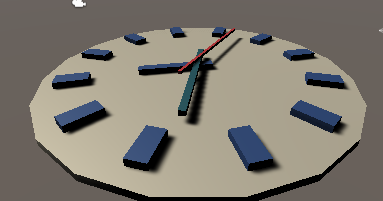

# unity-clock
This project contains the assets and code for an analog clock in Unity.  
The arms of the clock have 2 types of settings:  

1. Smooth/continuous movement
2. Discrete movement  

This is an attempt of mine to start developing games and learn more about the tools that are used to do so(game engines like  Unity).  

Built by following the tutorial here: https://catlikecoding.com/unity/tutorials/basics/game-objects-and-scripts/
